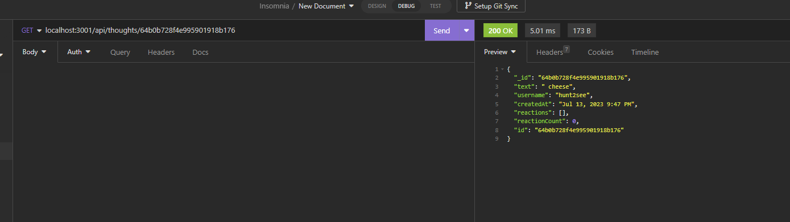

 
# Social Network API

## Description

I created this project ot practice monogodb connection along with mongoose routes practice.  These two programs allow me to better practice creating my own apis. for this situation I created  an api that could be used for a social networking program. Durring this project I learned how to use mongoose to create models and routes  in a more efficent way.

## Table of Contents (Optional)

- [Installation](#installation)
- [Usage](#usage)
- [Credits](#credits)
- [License](#license)
- [contribute](#How_to_Contribute)

## Installation

To run this aplacation please install mongodb coumpas, and run a npm i to get the required packages. Then change the db name in server js to fit you api's name.

## Usage
video walkthought: https://youtu.be/EmjVoF3kt2c 
To use this project download insomina or an applacation like it, run the aplactaion on local host and use the routes in the api folder.

;

## License

Copyright 2023, 

    Permission is hereby granted, free of charge, to any person obtaining a copy of this software and associated documentation files (the “Software”), to deal in the Software without 
    restriction, including without limitation the rights to use, copy, modify, merge, publish, distribute, sublicense, and/or sell copies of the Software, and to permit persons to whom 
    the Software is furnished to do so,subject to the following conditions:
    The above copyright notice and this permission notice shall be included in all copies or substantial portions of the Software.
    THE SOFTWARE IS PROVIDED “AS IS”, WITHOUT WARRANTY OF ANY KIND, EXPRESS OR IMPLIED, INCLUDING BUT NOT LIMITED TO THE WARRANTIES OF MERCHANTABILITY, FITNESS FOR A PARTICULAR PURPOSE 
    AND NONINFRINGEMENT. IN NO EVENT SHALL THE AUTHORS OR COPYRIGHT HOLDERS BE LIABLE FOR ANY CLAIM, DAMAGES OR OTHER LIABILITY, WHETHER IN AN ACTION OF CONTRACT, TORT OR OTHERWISE, 
    ARISING FROM, OUT OF OR IN CONNECTION WITH THE SOFTWARE OR THE USE OR OTHER DEALINGS IN THE SOFTWARE.
(https://opensource.org/licenses/MIT)

## How to Contribute

You can contribute by expanding the catagories for this aplacation.
